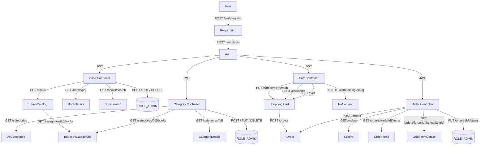

# JV Online Book Store

[](https://github.com/ipantazi/jv-online-book-store/actions/workflows/ci.yml)


## 🚀 Introduction

**JV Online Book Store** is a Spring Boot–based backend API for browsing and purchasing books.  

This project was developed as a learning exercise to deepen understanding of building RESTful web applications using Spring Boot.
It mimics a simplified version of an online bookstore and showcases best practices in layered architecture,
integration testing, and relational database interaction.

## It demonstrates:

- **User** management with registration, login and JWT‑based security.
- **Book** catalog with CRUD and search/filtering capabilities.
- **Category** hierarchy and book categorization.
- **ShoppingCart** functionality with add/update/remove items.
- **Order** placement and status tracking.
- Soft deletes and auditing via JPA (`isDeleted` flags).
- Validation, exception handling, and integration tests for each layer.

## 🛠 Technologies & Tools

- **Java21**, **SpringBoot3.4**
- **Spring Security** (JWT, role‑based)
- **Spring Data JPA** (MySQL)
- **Liquibase** for schema migrations
- **MapStruct** + **Lombok** for DTO mapping
- **Bean Validation** (Hibernate Validator)
- **Swagger(OpenAPI)** via Springdoc
- **JUnit5**, **Mockito**, **Testcontainers** for testing
- **Docker** & **docker‑compose** for local development
- **Checkstyle** to enforce code style

## 🔍 Key Features

### Authentication & Authorization
- **POST** `/auth/registration` – user signup with field validation & password hashing.
- **POST** `/auth/login` – issue JWT access token.
- **Method‑level security** with `@PreAuthorize` annotations.

### Book Catalog
- **GET** `/books` – paginated list (excluding “safe‑deleted” items).
- **GET** `/books/{id}` – fetch one book.
- **GET** `/books/search` – filter by title, author, isbn, price range.
- **POST / PUT / DELETE** secured endpoints (ROLE_ADMIN).

### Categories
- **GET** `/categories` – list all active categories.
- **GET** `/categories/{id}` – single category detail.
- **GET** `/categories/{id}/books` – list of books by category
- **POST / PUT / DELETE** – secured endpoints for managing categories (ROLE_ADMIN).

### Shopping Cart
- **GET** `/cart` – view current user’s cart.
- **POST** `/cart/items` – add an item.
- **PUT** `/cart/items/{itemId}` – update quantity.
- **DELETE** `/cart/items/{itemId}` – remove item.

### Orders
- **GET** `/orders` – list your orders (with pagination).
- **POST** `/orders` – place a new order from current cart.
- **GET** `/orders/{orderId}/items` – view all items in a specific order.
- **GET** `/orders/{orderId}/items/{itemId}` – view a specific item in an order.
- **PUT** `/orders/{id}/status` – change order status (ROLE_ADMIN).

## 📦 Getting Started

### 1. **Clone** the repo
```bash
git clone https://github.com/ipantazi/jv-online-book-store.git
cd jv-online-book-store
```
   
### 2. **Configure**

Copy .env.template → .env and adjust your DB credentials (MySQL by default).

### 3. **Run with Docker**
```bash
docker compose up --build
```
MySQL will start automatically. MySQL is used as the primary database in both the application and the integration tests.

### 4. **Browse the API**
#### Once the application is running, you can explore and test the API using *Swagger UI*:
[http://localhost:8080/api/swagger-ui/index.html](http://localhost:8080/api/swagger-ui/index.html)
   
This interface allows you to view available endpoints, inspect request/response structures, 
and execute calls directly from your browser.
   
### 5. **Run Tests**
To execute the full test suite (unit + integration), run:
```bash
mvn clean verify
```
You should see near 100% test coverage on ShoppingCartServiceImpl and high coverage on ShoppingCartController,
confirming that cart-related functionality is well covered by tests.

🧪 Test reports are generated at:

      /target/site/jacoco/index.html

📊 Coverage badge:

[](https://codecov.io/github/ipantazi/jv-online-book-store)

### 6. ⚙️ **Postman Collection**

I’ve included a Postman collection in [📄 postman/OnlineBookStore.postman_collection.json](postman/OnlineBookStore.postman_collection.json).

#### Import it to explore all endpoints and example requests/responses:
   
Click Import → Upload Files → Select 

`postman/jv-online-book-store.postman_collection.json`

ℹ️ Replace localhost:8080 with your deployed URL if running on a remote server.

#### This collection contains:
   
- Sample requests for authentication and authorization.
   
- Endpoints for books, categories, shopping cart, and orders. 
All endpoints grouped logically by folders inside the collection.
   
- All POST/PUT requests contain example bodies in the collection.
   
- Both user and admin-level requests.

#### Almost all endpoints require a *JWT token*. To obtain it:
   
##### a. 🔐 Register:   
`POST /api/auth/register`
   
##### b. 🔑 Login:
`POST /api/auth/login`
   
##### c. 📋 Copy the token from the login response and add it to the *Authorization header*:
`Authorization: Bearer <your_token>`

### 7. ☁️ Deployment
You can deploy the application to AWS (EC2 + RDS + ECR) using Docker.

📖 See full step-by-step instructions in [docs/DEPLOYMENT.md](docs/DEPLOYMENT.md)

## 🧗‍♂️ **Challenges & Learning**
- 🔍 Implementing Dynamic Search
    
  Built a flexible Specification-based query builder to support multiple optional filters — including title, 
  author, ISBN, category, and price range. Faced challenges with handling null inputs and combining filters dynamically. 
  Solved it by creating a clean, extensible structure for composing predicates only when values are present.


- 🧹 Soft Delete Handling
    
  Implemented @SQLDelete and @SQLRestriction annotations to support soft deletes. 
  Faced issues with mismatches between database columns and entity fields (e.g. column names, types, deletion flags). 
  Resolved them by aligning the database schema and entity configuration to avoid conflicts.


- 🔄 Managing Entity Relationships
    
  Encountered difficulties with bidirectional associations, especially during schema setup via Liquibase. 
  Errors occurred because related entities needed to be created in a specific order. 
  Solved this by carefully designing the test data and ensuring all relationships were initialized correctly.

## 🎥 Demo Video
### I’ve recorded a short 5‑minute Loom walkthrough showing:
- User registration & login
- Browsing the book catalog
- Adding to cart & checking out
- Swagger UI & test coverage report
### 👉 [Watch the demo on Loom](https://www.loom.com/share/468363bab3d440a39191b58cdfd0e290?sid=f137a61d-6623-465c-b6d0-cf013558d28c)

## ⭐️ I hope you enjoy exploring this project! Feel free to Star ⭐️ or Fork 🍴 if you find it useful.